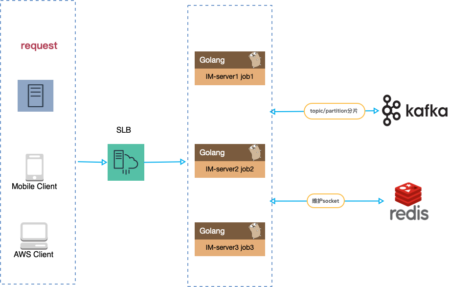

im v0.0.1
==============

[](https://golang.org/)
[](https://github.com/songkaiha/im/actions)
[](https://pkg.go.dev/github.com/songkaiha/im)
[](https://goreportcard.com/report/github.com/songkaiha/im)

基于go语言开发的im，使用websocket.

---------------------------------------
* [特性](#特性)
* [架构](#架构)
* [快速开始](#快速开始)
* [文档](#文档)
* [更多](#更多)

---------------------------------------


## 特性
* 支持无状态的分布式部署（这是重点！！！）
* 轻量级
* 高性能
* 纯Golang语言实现
* 支持查看设备在线总数
* 支持单聊，未来要支持群聊
* 支持心跳监测、查看设备是否在线
* 支持服务端发送消息api，方便集成
* 基于gin框架开发，非常利于项目扩展和二次开发
* 基于kafka和redis

## 架构


## 快速开始


### Run
```
   source env/dev.sh
   go run cmd/run.go
```

### 配置
    你可以修改你的配置，在configs目录

## 文档
[docs](./docs/)

## 更多
最新功能持续开发中，敬请期待。。。
